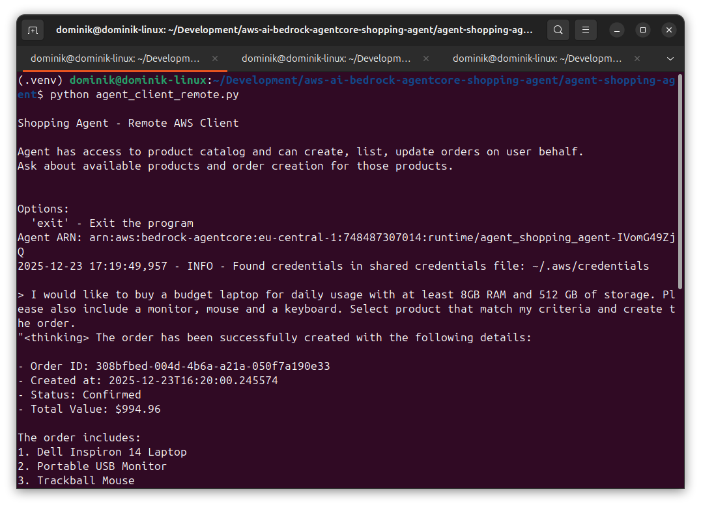
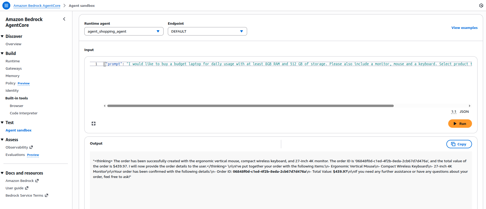

# 📦 Amazon Bedrock AgentCore Shopping Agent Code Sample

## 📝 Overview

This repository contains code for a simplified shopping agent using the Strands Agents Python SDK, hosted in
Amazon Bedrock AgentCore.

The agent has access to a simplified Products Catalog and Order Management System, allowing it to create orders on the
user's behalf using products from the catalog. You can run the agent both locally and on AWS.

The end result is a functional agent that helps users find the right products for their needs and create orders using
prompts like:

```text
I would like to buy a budget laptop for daily usage with at least 8GB RAM and 512 GB of storage.
Please also include a monitor, mouse and a keyboard.
Select product that match my criteria and create the order.
```

The agent processes the user's request using an LLM and MCP Tools. The result is a created order reported by the agent:

```text
Your order has been created successfully! Here are the details:

- **Dell Inspiron 14 Laptop** - Price: $699.99
- **Wireless Gaming Mouse** - Price: $59.99
- **Mechanical Gaming Keyboard** - Price: $129.99
- **27-inch 4K Monitor** - Price: $349.99

**Order ID:** 9f992c3d-2af9-4de4-b8e2-1f939237866f

**Total Value:** $1239.96
```

The created order can then be managed further using the agent or traditional REST API calls.

## 🛠️ Tech Stack

- **Language:** Python 3.12
- **Framework:** Flask
- **Testing:** pytest
- **Deployment:** Amazon Bedrock AgentCore, AWS Elastic Beanstalk
- **Storage:** In-memory (no database required)

## 🏗️ Architecture

The diagram below depicts the architecture of the solution.


The agent is built using the Strands Agents Python SDK and hosted in Amazon Bedrock AgentCore. It has access to two
backing services: Products Catalog and Order Management System. Both services are implemented as simple REST APIs. The
agent accesses these backing services through MCP Tools that forward requests accordingly. The backing services are
hosted on AWS Elastic Beanstalk, while the LLM runs in Amazon Bedrock.

## MCP Tools

The agent has access to two types of tools: Products Catalog Tools and Order Management Tools.

The Products Catalog Tools retrieve products from the Products Catalog service, while the Order Management Tools handle
order operations. Each MCP Tool acts as a proxy, calling the corresponding backing service REST API to execute its task.

Products Catalog Tools include listing products and retrieving product details.

Order Management Tools include creating, listing, updating, and canceling orders.

## Microservices

Two microservices have been implemented: Products Catalog and Order Management System.

Both serve as backing services for the MCP Tools exposed to the agent.

For simplicity, these microservices don't use any database storage. All data is kept in memory.

## 🚀 Usage

### Prerequisites

- Linux
- Bash
- Python 3.12 with pip installed on your machine
- AWS CLI installed and configured
- EB CLI installed and configured

### Running the Agent Locally

You can run the agent and backing services locally. Note that you still need AWS credentials configured since the LLM
runs in Amazon Bedrock.

First, start the agent using the local runner – it will run in interactive mode:

```bash
cd agent-shopping-agent
python -m venv .venv
source .venv/bin/activate
pip install -r requirements.txt
python agent_runner_local.py
```

Then, run the Products Catalog microservice locally:

```bash
cd microservice-products-catalog
python -m venv .venv
source .venv/bin/activate
pip install -r requirements.txt
FLASK_RUN_PORT=5001 python application.py
```

Finally, run the Orders microservice locally:

```bash
cd microservice-orders
python -m venv .venv
source .venv/bin/activate
pip install -r requirements.txt
FLASK_RUN_PORT=5002 python application.py
```

Now you can interact with the agent using prompts like the following:


This will produce the following response:


See more under:

- [agent-shopping-agent/README.md](agent-shopping-agent/README.md)
- [microservice-products-catalog/README.md](microservice-products-catalog/README.md)
- [microservice-orders/README.md](microservice-orders/README.md)

### Running the Agent on AWS

To run the agent on AWS, the backing microservices need to be deployed to AWS Elastic Beanstalk first, and then the
agent can be deployed to Bedrock AgentCore.

The backing microservices are deployed using the EB CLI. To simplify deployment, I created deployment scripts.

This script for `microservice-products-catalog` is
available [here](https://github.com/dominikcebula/aws-ai-bedrock-agentcore-shopping-agent/blob/main/microservice-products-catalog/deploy.sh)
and for
`microservice-orders` [here](https://github.com/dominikcebula/aws-ai-bedrock-agentcore-shopping-agent/blob/main/microservice-orders/deploy.sh).

Running `deploy.sh` for each microservice deploys it to AWS Elastic Beanstalk.


Once the backing microservices are deployed, the agent can be deployed to Bedrock AgentCore
using [deploy.py](https://github.com/dominikcebula/aws-ai-bedrock-agentcore-shopping-agent/blob/main/agent-shopping-agent/deploy.py).

Additionally, [deploy.py](https://github.com/dominikcebula/aws-ai-bedrock-agentcore-shopping-agent/blob/main/agent-shopping-agent/deploy.py)
dynamically discovers the URLs of the backing microservices deployed to AWS Elastic Beanstalk and exposes them as
environment variables for the agent to use when invoking MCP Tools.

See the full source code
in [deploy.py](https://github.com/dominikcebula/aws-ai-bedrock-agentcore-shopping-agent/blob/main/agent-shopping-agent/deploy.py).

To deploy the agent, execute the following commands:

```bash
python -m venv .venv
source .venv/bin/activate
pip install -r requirements.txt
python deploy.py
```

The deployment process will look similar to this:


With both the backing microservices and agent deployed to AWS, you can invoke the agent in the cloud.

There are two ways to do this.

The first is to
use [agent_client_remote.py](https://github.com/dominikcebula/aws-ai-bedrock-agentcore-shopping-agent/blob/main/agent-shopping-agent/agent_client_remote.py),
which runs a client locally and sends requests to the agent hosted in AWS Bedrock AgentCore.

Usage is similar to running locally, except that all operations are executed in the cloud via the remote AWS client:



The second option is to use the Amazon Bedrock AgentCore web console to send requests to the agent.



See more under:

- [agent-shopping-agent/README.md](agent-shopping-agent/README.md)
- [microservice-products-catalog/README.md](microservice-products-catalog/README.md)
- [microservice-orders/README.md](microservice-orders/README.md)

## ✍ Author

Dominik Cebula

- https://dominikcebula.com/
- https://blog.dominikcebula.com/
- https://www.udemy.com/user/dominik-cebula/
