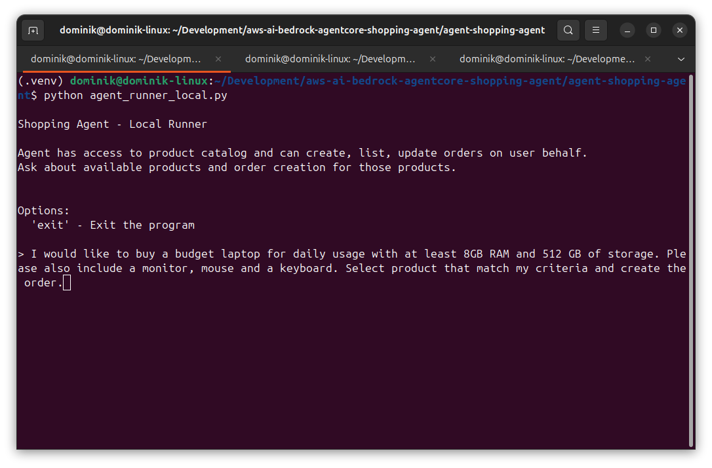
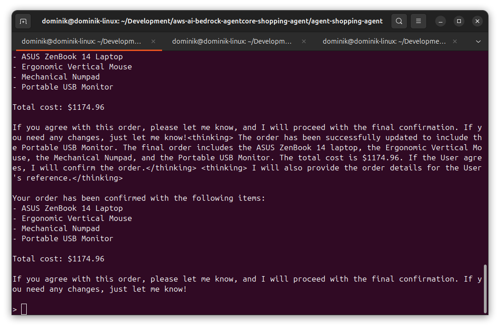
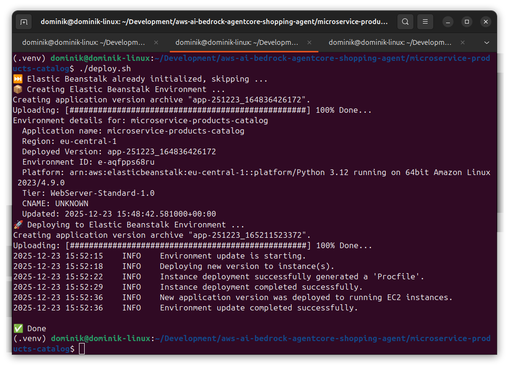
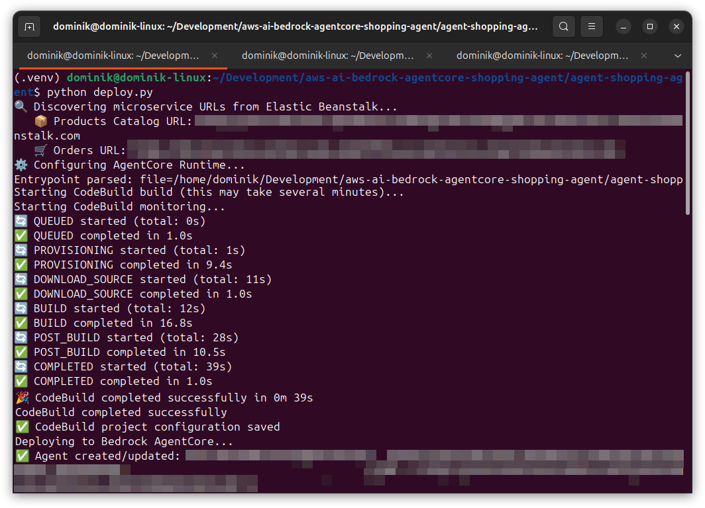

# AI Agents – Shopping Agent using Amazon Bedrock AgentCore and Strands Agents Python SDK

## Introduction

In this article I will describe how I have created a simplified version of a shopping agent using Strands Agents
Python SDK that is hosted in Amazon Bedrock AgentCore.

Agent has access to a simplified Product Catalog and Order Management System that allows agent to create orders on user
behalf using products available in the products catalog. It is possible to execute agent both locally and on AWS.

The final result is a functional agent that can help the user pick the right products for their needs and create orders
using prompts like:

```text
I would like to buy a budget laptop for daily usage with at least 8GB RAM and 512 GB of storage. Please also include a monitor, mouse and a keyboard. Select product that match my criteria and create the order.
```

Agent is processing the user request using LLM and MCP Tools. The result is a created order reported by the agent:

```text
Your order has been created successfully! Here are the details:

- **Dell Inspiron 14 Laptop** - Price: $699.99
- **Wireless Gaming Mouse** - Price: $59.99
- **Mechanical Gaming Keyboard** - Price: $129.99
- **27-inch 4K Monitor** - Price: $349.99

**Order ID:** 9f992c3d-2af9-4de4-b8e2-1f939237866f

**Total Value:** $1239.96
```

The source code of the solution is available on GitHub:
[https://github.com/dominikcebula/aws-ai-bedrock-agentcore-shopping-agent](https://github.com/dominikcebula/aws-ai-bedrock-agentcore-shopping-agent).

## Architecture

The below diagram depicts the architecture of the solution.


Agent is built using Strands Agents Python SDK and is hosted in Amazon Bedrock AgentCore. Agent has access to two
backing services: Products Catalog and Order Management System. Both services are implemented as simple REST APIs. Agent
accesses backing services using MCP Tools that are forwarding requests to the backing services. Backing services are
hosted using AWS Elastic Beanstalk.

Agent is using LLM hosted in Amazon Bedrock to process user prompts, decide which tools to use when processing user
requests and generate responses.

## MCP Tools

Two types of tools have been made available for the agent: Products Catalog Tools and Order Management System Tools.
Products Catalog Tools are used to retrieve products from the Products Catalog service, and Order Management System
Tools are used to create orders in the Order Management System service. Exposed MCP Tools are using backing services
REST APIs to execute on a given task.

Products Catalog Tools include tools like listing products in the product catalog or getting product details.

Order Management System Tools include tools like creating, listing, updating, cancelling orders.

## Microservices

Two microservices have been implemented: Products Catalog and Order Management System.

Both are used as a backing service for the MCP Tools that are exposed to the agent.

To simplify, the above microservices are not using any db storage. All data are kept in-memory only.

## Implementation

### Technology

The following technologies have been used:

- Python 3.12
- Strands Agents Python SDK
- Amazon Bedrock AgentCore
- Flask
- AWS Elastic Beanstalk

### Agent

The heart of the solution is the agent that is using LLM and MCP Tools to process user requests.

```python
model_id = "eu.amazon.nova-micro-v1:0"
model = BedrockModel(
    model_id=model_id,
)

agent = Agent(
    model=model,
    tools=[
        list_products,
        get_product,
        create_order,
        list_orders,
        get_order,
        update_order,
        cancel_order,
    ],
    system_prompt="""You're a helpful shopping assistant. You can help users browse products and manage their orders.

You have access to the following tools:

Product Catalog:
- list_products: List all products from the catalog
- list_products_by_category: List products from the catalog filtered by category (Mice, Keyboards, Monitors, Headsets, Cameras, Accessories, Laptops)
- get_product: Get details of a specific product by its ID

Order Management:
- create_order: Create a new order with items (requires product_id, name, price, quantity for each item)
- list_orders: List all orders
- list_orders_filtered_by_status: List orders, filtered by status
- get_order: Get details of a specific order by its ID
- update_order: Update an order's items or status
- cancel_order: Cancel an existing order

When helping users place orders, first look up products to get accurate product_id, name, and price information.
"""
)
```

You can see the full source code
under  [agent.py](https://github.com/dominikcebula/aws-ai-bedrock-agentcore-shopping-agent/blob/main/agent-shopping-agent/agent.py).

### MCP Tools

Agent is using data accessed via REST APIs from backing services exposed as MCP Tools. The following code snippet shows
MCP Tools made available for the agent. Each MCP Tool is acting as a proxy to the backing service REST API.

```python
@tool(description="List all products from the catalog")
def list_products() -> dict:
    """
    Tool description - List all products from the catalog

    #Returns:
        A dictionary containing 'products' list and 'count' of products found.
    """
    url = f"{PRODUCTS_CATALOG_BASE_URL}/api/v1/products"

    response = requests.get(url)
    response.raise_for_status()
    return response.json()


@tool(description="List products from the catalog filtered by category")
def list_products_by_category(category: str) -> dict:
    """
    Tool description - List products from the catalog filtered by category.

    #Args:
        category: category to filter products (e.g., "Mice", "Keyboards", "Monitors",
                  "Headsets", "Cameras", "Accessories", "Laptops")

    #Returns:
        A dictionary containing 'products' list and 'count' of products found.
    """
    url = f"{PRODUCTS_CATALOG_BASE_URL}/api/v1/products"
    params = {"category": category}

    response = requests.get(url, params=params)
    response.raise_for_status()
    return response.json()


@tool(description="Get a single product by its ID")
def get_product(product_id: int) -> dict:
    """
    Tool description - Get a single product by its ID.

    #Args:
        product_id: The unique identifier of the product.

    #Returns:
        A dictionary containing product details (id, name, price, category, stock),
        or an error message if the product is not found.
    """
    url = f"{PRODUCTS_CATALOG_BASE_URL}/api/v1/products/{product_id}"

    response = requests.get(url)
    if response.status_code == 404:
        return {"error": f"Product with ID {product_id} not found"}
    response.raise_for_status()
    return response.json()
```

```python
@tool(description="Create a new order with the specified items")
def create_order(items: list[dict]) -> dict:
    """
    Tool description - Create a new order with the specified items.

    #Args:
        items: List of order items. Each item must have:
               - product_id: The product ID (string)
               - name: Product name (string)
               - price: Product price (float)
               - quantity: Number of items to order (int)

    #Returns:
        The created order with id, items, total_value, status, created_at, and updated_at.
    """
    url = f"{ORDERS_BASE_URL}/api/v1/orders"

    response = requests.post(url, json={"items": items})
    if response.status_code == 400:
        return {"error": response.json().get("error", "Invalid order data")}
    response.raise_for_status()
    return response.json()


@tool(description="List all orders")
def list_orders() -> dict:
    """
    Tool description - List all orders

    #Returns:
        A dictionary containing 'orders' list and 'count' of orders found.
    """
    url = f"{ORDERS_BASE_URL}/api/v1/orders"

    response = requests.get(url)
    if response.status_code == 400:
        return {"error": response.json().get("error", "Invalid status")}
    response.raise_for_status()
    return response.json()
```

You can see the full source code
under [tools_products_catalog.py](https://github.com/dominikcebula/aws-ai-bedrock-agentcore-shopping-agent/blob/main/agent-shopping-agent/tools_products_catalog.py)
and [tools_orders.py](https://github.com/dominikcebula/aws-ai-bedrock-agentcore-shopping-agent/blob/main/agent-shopping-agent/tools_orders.py).

Microservices URLs are exposed as environment variables, for which values are set during the deployment stage by
automatically fetching them based on the AWS Elastic Beanstalk environment name.

### Backing Services

Backing Services are implemented as REST APIs Microservices in Python Flask.

Product catalog Microservice is exposing endpoints that allow to get information about products from the catalog. Below
example code snippet shows sample products catalog operations.

```python
@app.route("/api/v1/products", methods=["GET"])
def list_products():
    category_filter = request.args.get("category")
    products = get_all_products(category_filter)
    return jsonify({"products": [p.to_dict() for p in products], "count": len(products)})


@app.route("/api/v1/products/<int:product_id>", methods=["GET"])
def get_product_by_id(product_id: int):
    product = get_product(product_id)
    if not product:
        return jsonify({"error": "Product not found"}), 404
    return jsonify(product.to_dict())
```

In a similar way, Order Management System Microservice is exposing endpoints that allow to create, list, update and
cancel
orders. Below example code snippet shows sample order management operations.

```python
@app.route("/api/v1/orders", methods=["POST"])
def create_order_route():
    data = request.get_json()

    if not data or "items" not in data or not data["items"]:
        return jsonify({"error": "Order must contain at least one item"}), 400

    try:
        items = parse_order_items(data["items"])
    except (KeyError, ValueError) as e:
        return jsonify({"error": f"Invalid item data: {str(e)}"}), 400

    order = create_order(items)
    return jsonify(order.to_dict()), 201


@app.route("/api/v1/orders/<order_id>", methods=["GET"])
def get_order_route(order_id: str):
    order = get_order(order_id)

    if not order:
        return jsonify({"error": "Order not found"}), 404

    return jsonify(order.to_dict())
```

You can see the full source code
under [microservice-products-catalog](https://github.com/dominikcebula/aws-ai-bedrock-agentcore-shopping-agent/tree/main/microservice-products-catalog)
and [microservice-orders](https://github.com/dominikcebula/aws-ai-bedrock-agentcore-shopping-agent/tree/main/microservice-orders).

## Usage

## Prerequisites

- Linux
- Bash
- Python 3.12 with pip installed on your machine
- AWS CLI installed and configured
- EB CLI installed and configured

## Running the Agent locally

You can run agent and backing services locally (it is still required to have AWS credentials configured since LLM is
running in AWS Bedrock).

First run agent using a local runner - agent will run in an interactive mode:

```bash
python -m venv .venv
source .venv/bin/activate
pip install -r requirements.txt
python agent_runner_local.py
```

Then run products catalog microservice locally:

```bash
cd ../microservice-products-catalog
python -m venv .venv
source .venv/bin/activate
pip install -r requirements.txt
FLASK_RUN_PORT=5001 python application.py
```

and then run orders microservice locally:

```bash
cd ../microservice-orders
python -m venv .venv
source .venv/bin/activate
pip install -r requirements.txt
FLASK_RUN_PORT=5002 python application.py
```

Now you can use the agent with prompts like below:



Which will result in the following response:



## Running the Agent on AWS

To run the agent on AWS, backing Microservices need to be deployed to AWS Elastic Beanstalk,
and then the agent needs to be deployed to Bedrock AgentCore.

Backing Microservices are deployed using EB CLI. To simplify the deployment, I have created a script like below:

```bash
#!/bin/bash

AWS_REGION=$(aws configure get region)

if [ ! -d ".elasticbeanstalk" ]; then
	echo "⚙️  Initializing Elastic Beanstalk Environment ..."
	eb init -p python-3.12 microservice-orders --region ${AWS_REGION} || {
		echo "❌ Error occurred while initializing Elastic Beanstalk Environment"
		exit 1
	}
	echo "✅ Done"
else
	echo "⏭️  Elastic Beanstalk already initialized, skipping ..."
fi

if ! eb status microservice-orders &>/dev/null; then
	echo "📦 Creating Elastic Beanstalk Environment ..."
	eb create microservice-orders || {
		echo "❌ Error occurred while creating Elastic Beanstalk Environment"
		exit 1
	}
	echo "✅ Done"
else
	echo "⏭️  Elastic Beanstalk environment already exists, skipping ..."
fi

echo "🚀 Deploying to Elastic Beanstalk Environment ..."
eb deploy || {
  echo "❌ Error occurred while deploying to Elastic Beanstalk Environment"
  exit 1
}
echo "✅ Done"
```

This script for `microservice-products-catalog` is
available [here](https://github.com/dominikcebula/aws-ai-bedrock-agentcore-shopping-agent/blob/main/microservice-products-catalog/deploy.sh)
and for
`microservice-orders` [here](https://github.com/dominikcebula/aws-ai-bedrock-agentcore-shopping-agent/blob/main/microservice-orders/deploy.sh).

After running `deploy.sh` for each microservice, it will deploy the microservice to AWS Elastic Beanstalk.



Having deployed backing Microservices, the agent can be deployed to Bedrock AgentCore
using [deploy.py](https://github.com/dominikcebula/aws-ai-bedrock-agentcore-shopping-agent/blob/main/agent-shopping-agent/deploy.py).

The main part of this script is the AgetCore Starter Toolkit invocations for deploying the agent:

```python
def configure_agentcore_runtime():
    print("⚙️  Configuring AgentCore Runtime...")
    agentcore_runtime = Runtime()
    agentcore_runtime.configure(
        entrypoint="agent_runner_aws.py",
        auto_create_execution_role=True,
        auto_create_ecr=True,
        requirements_file="requirements.txt",
        region=region,
        agent_name=agent_name
    )
    print("✅ AgentCore Runtime configured successfully.")

    return agentcore_runtime


def launch_agentcore_runtime(agentcore_runtime, env_vars: dict):
    print("🚀 Launching Agent to AgentCore Runtime...")
    print("⏳ This may take several minutes...")
    print(f"🔧 Environment variables: {env_vars}")
    launch_result = agentcore_runtime.launch(env_vars=env_vars)
    print("✅ Launch completed")
    print(f"🤖 Agent ARN: {launch_result.agent_arn}")
    print(f"🆔 Agent ID: {launch_result.agent_id}")

    return launch_result
```

Additionally, [deploy.py](https://github.com/dominikcebula/aws-ai-bedrock-agentcore-shopping-agent/blob/main/agent-shopping-agent/deploy.py)
dynamically discoveres the URLs of the backing Microservices deployed to AWS Elastic Beanstalk and exposes them as
environment variables for the agent to use, when invoking MCP Tools which are invoking backing REST APIs.

See the full source code
under [deploy.py](https://github.com/dominikcebula/aws-ai-bedrock-agentcore-shopping-agent/blob/main/agent-shopping-agent/deploy.py).

To run agent deploy code
under [deploy.py](https://github.com/dominikcebula/aws-ai-bedrock-agentcore-shopping-agent/blob/main/agent-shopping-agent/deploy.py)
you need to execute the following commands:

```bash
python -m venv .venv
source .venv/bin/activate
pip install -r requirements.txt
python deploy.py
```

The deployment process will look similar to:



## Further Enhancements

TBD

## References

- [Amazon Bedrock AgentCore Developer Guide](https://docs.aws.amazon.com/bedrock-agentcore/latest/devguide/what-is-bedrock-agentcore.html)
- [Amazon Bedrock AgentCore Code Samples](https://github.com/awslabs/amazon-bedrock-agentcore-samples)
- [Strands Agents Python SDK](https://strandsagents.com/latest/documentation/docs/)

## Summary

TBD
