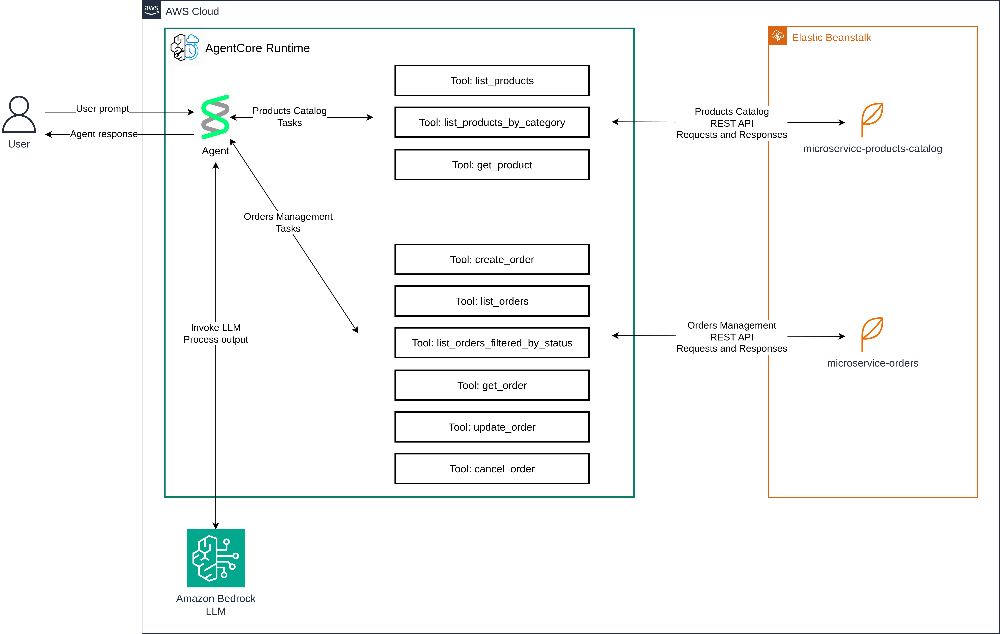

# AI Agents – Shopping Agent using Amazon Bedrock AgentCore and Strands Agents Python SDK

## Introduction

In this article I will describe how I have created a simplified version of a shopping agent using Strands Agents
Python SDK that is hosted in Amazon Bedrock AgentCore. Agent has access to a simplified Product Catalog and
Order Management System that allows agent to create orders on user behalf using products available in the products
catalog. It is possible to execute agent both locally and on AWS.

The final result is a functional agent that can help the user pick the right products for their needs and create orders
using prompts like:

```text
I would like to buy a budget laptop for daily usage with at least 8GB RAM and 512 GB of storage. Please also include a monitor, mouse and a keyboard. Select product that match my criteria and create the order.
```

Agent is processing the user request using LLM and MCP Tools. The result is a created order reported by the agent:

```text
Your order has been created successfully! Here are the details:

- **Dell Inspiron 14 Laptop** - Price: $699.99
- **Wireless Gaming Mouse** - Price: $59.99
- **Mechanical Gaming Keyboard** - Price: $129.99
- **27-inch 4K Monitor** - Price: $349.99

**Order ID:** 9f992c3d-2af9-4de4-b8e2-1f939237866f

**Total Value:** $1239.96
```

## Architecture

The below diagram depicts the architecture of the solution.



Agent is built using Strands Agents Python SDK and is hosted in Amazon Bedrock AgentCore. Agent has access to two
backing services: Products Catalog and Order Management System. Both services are implemented as simple REST APIs. Agent
accesses backing services using MCP Tools that are forwarding requests to the backing services. Backing services are
hosted using AWS Elastic Beanstalk.

Agent is using LLM hosted in Amazon Bedrock to process user prompts, decide which tools to use when processing user
requests and generate responses.

## MCP Tools

Two types of tools have been made available for the agent: Products Catalog Tools and Order Management System Tools.
Products Catalog Tools are used to retrieve products from the Products Catalog service, and Order Management System
Tools are used to create orders in the Order Management System service. Exposed MCP Tools are using backing services
REST APIs to execute on a given task.

Products Catalog Tools include tools like listing products in the product catalog or getting product details.

Order Management System Tools include tools like creating, listing, updating, cancelling orders.

## Microservices

Two microservices have been implemented: Products Catalog and Order Management System.

Both are used as a backing service for the MCP Tools that are exposed to the agent.

To simplify, the above microservices are not using any db storage. All data are kept in-memory only.

## Implementation

### Technology

The following technologies have been used:

- Python 3.12
- Strands Agents Python SDK
- Amazon Bedrock AgentCore
- Flask
- AWS Elastic Beanstalk

### Agent

The heart of the solution is the agent that is using LLM and MCP Tools to process user requests.

```python
model_id = "eu.amazon.nova-micro-v1:0"
model = BedrockModel(
    model_id=model_id,
)

agent = Agent(
    model=model,
    tools=[
        list_products,
        get_product,
        create_order,
        list_orders,
        get_order,
        update_order,
        cancel_order,
    ],
    system_prompt="""You're a helpful shopping assistant. You can help users browse products and manage their orders.

You have access to the following tools:

Product Catalog:
- list_products: List all products from the catalog
- list_products_by_category: List products from the catalog filtered by category (Mice, Keyboards, Monitors, Headsets, Cameras, Accessories, Laptops)
- get_product: Get details of a specific product by its ID

Order Management:
- create_order: Create a new order with items (requires product_id, name, price, quantity for each item)
- list_orders: List all orders
- list_orders_filtered_by_status: List orders, filtered by status
- get_order: Get details of a specific order by its ID
- update_order: Update an order's items or status
- cancel_order: Cancel an existing order

When helping users place orders, first look up products to get accurate product_id, name, and price information.
"""
)
```

You can see the full source code
under  [agent.py](https://github.com/dominikcebula/aws-ai-bedrock-agentcore-shopping-agent/blob/main/agent-shopping-agent/agent.py).

### MCP Tools

TBD

### Backing Services

TBD

## Deployment

### Agent

TBD

### Backing Services

TBD

## Running the Agent locally

TBD

## Running the Agent on AWS

TBD

## Further Enhancements

TBD

## References

- [Amazon Bedrock AgentCore Developer Guide](https://docs.aws.amazon.com/bedrock-agentcore/latest/devguide/what-is-bedrock-agentcore.html)
- [Amazon Bedrock AgentCore Code Samples](https://github.com/awslabs/amazon-bedrock-agentcore-samples)
- [Strands Agents Python SDK](https://strandsagents.com/latest/documentation/docs/)

## Summary

TBD
